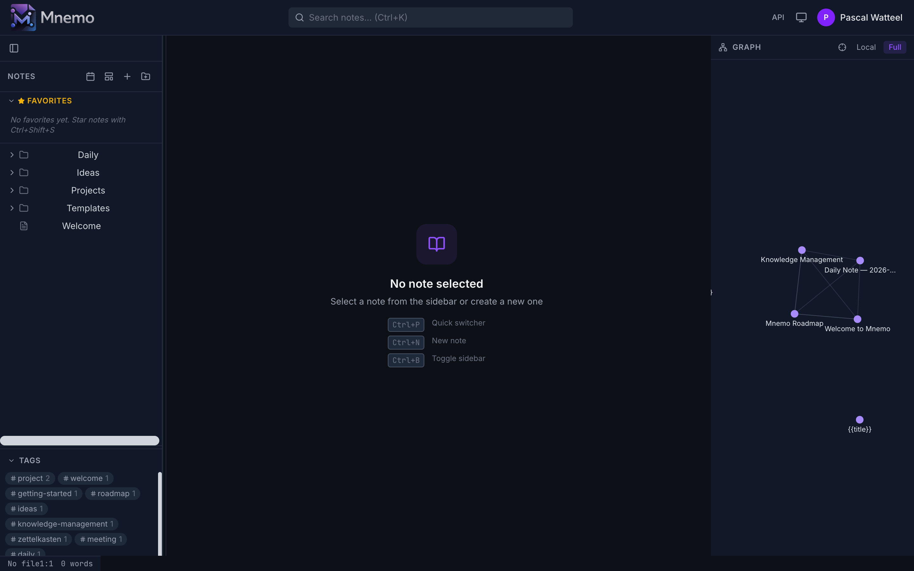
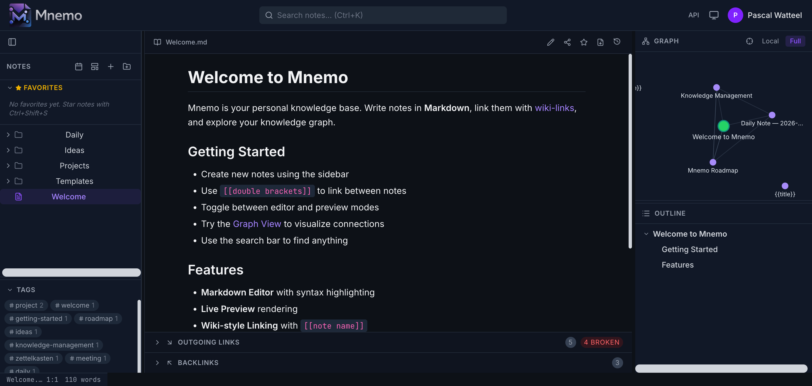
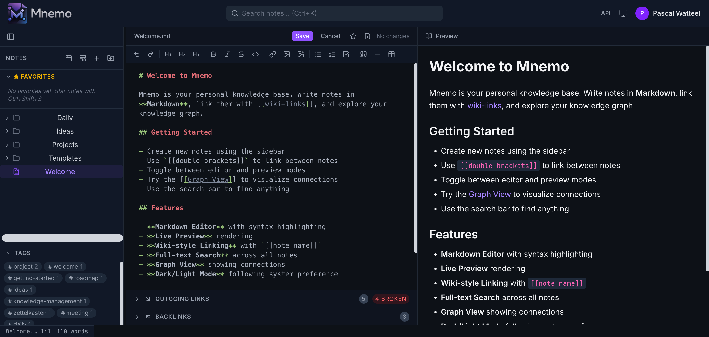

<p align="center">
  
</p>

<p align="center">
  <strong>A self-hosted, multi-user knowledge base with wiki-style linking, graph visualization, and mobile sync.</strong>
</p>

<p align="center">
  <a href="https://github.com/piwi3910/mnemo/actions"></a>
  <a href="https://github.com/piwi3910/mnemo/releases"></a>
  <a href="https://github.com/piwi3910/mnemo/blob/master/LICENSE"></a>
</p>

<p align="center">
  
</p>

---

## Features

### Editor & Notes
- **Markdown Editor** — CodeMirror 6 with syntax highlighting, formatting toolbar, and Vim mode
- **Live Preview** — rendered markdown with wiki-links, frontmatter display, and code fences
- **Auto-save** — 2-second debounce saves automatically while editing
- **Wiki-style Linking** — `[[double brackets]]` with autocomplete and broken link detection
- **Full-text Search** — instant results across all notes
- **Version History** — browse and restore previous versions of any note
- **Image Upload** — drag into editor or use toolbar button
- **Frontmatter** — YAML metadata parsing with styled display
- **Templates** and **Daily Notes** for quick creation
- **Trash** — soft delete with restore capability (auto-purge after 30 days)
- **PDF Export** for any note
- **Breadcrumb Navigation** — clickable path segments above notes

### Knowledge Graph
- **Interactive D3.js graph** with zoom, pan, and drag
- **Local/Full view** toggle
- **Color-coded nodes** — active (green), starred (yellow stars), shared (orange), default (purple)
- **Mobile graph overlay** — mini expandable graph on phone screens

<p align="center">
  
</p>

### Mobile App (React Native)
- **Offline-first** — expo-sqlite local database with bidirectional sync
- **Full feature parity** — notes, search, graph, tags, settings, daily notes, templates, trash, history, sharing, admin
- **WebView editor** — same CodeMirror experience on mobile
- **Android APK** available via EAS Build
- **Auto-sync** on foreground, pull-to-refresh, manual sync button

### Multi-User & Security
- **Authentication** — email/password, OAuth (Google, GitHub), passkeys (WebAuthn)
- **Two-Factor Authentication** — TOTP with QR code setup and backup codes
- **Per-user isolation** — each user has their own notes directory
- **Note Sharing** — share notes/folders with read or read-write permissions
- **Access Requests** — request access to notes via wiki-links
- **API Keys** — scoped bearer tokens for programmatic access
- **Admin Panel** — manage users, invite codes, registration mode

### UI & Layout
- **Three-panel layout** — sidebar, content, graph+outline (all resizable)
- **Dark/Light theme** with system preference detection
- **Favorites sidebar** — quick access to starred notes
- **Drag-and-drop file tree** — move files and folders by dragging
- **Toast notifications** — global info/success/error feedback
- **Responsive mobile layout** — optimized for phone screens
- **Full WCAG accessibility** — ARIA roles, keyboard navigation, focus management

<p align="center">
  
</p>

### API & AI Agent Access
- **Swagger/OpenAPI docs** at `/api/docs`
- **30+ REST endpoints** — notes, search, graph, settings, sharing, auth, admin, sync
- **MCP Server** at `/api/mcp` — Model Context Protocol for AI agents (Claude Code, Cursor, etc.)
- **Sync API** — pull/push endpoints for mobile synchronization

### Plugin Ecosystem
12 plugins available via [mnemo-plugins](https://github.com/piwi3910/mnemo-plugins):

Slash Commands, Pomodoro Timer, Reading List, Writing Metrics, Excalidraw, Kanban Board, Mass Upload, Publish/Export, Flashcards, Presentation Mode, Calendar Journal, RSS Reader

---

## Tech Stack

| Component | Technology |
|-----------|------------|
| Frontend | React 19, Vite 8, TypeScript 5.9, Tailwind CSS 4 |
| Backend | Express 5, Prisma 7, TypeScript 5.9 |
| Database | SQLite (via better-sqlite3) |
| Mobile | Expo SDK 55, React Native, expo-sqlite |
| Editor | CodeMirror 6 with Vim mode |
| Graph | D3.js force-directed |
| Auth | better-auth (sessions, OAuth, passkeys, 2FA) |
| Runtime | Node.js 24 |

---

## Quick Start

### Docker (recommended)

```yaml
# docker-compose.yml
services:
  mnemo:
    image: ghcr.io/piwi3910/mnemo/mnemo:latest
    ports:
      - "3100:3000"
    volumes:
      - ./notes:/notes
      - mnemo-data:/data
    environment:
      - DATABASE_URL=file:/data/mnemo.db
      - BETTER_AUTH_SECRET=change-me-use-openssl-rand-hex-32
      - APP_URL=http://localhost:3100

volumes:
  mnemo-data:
```

```bash
docker compose up -d
```

Open http://localhost:3100 — the first user to register becomes admin.

### From Source

```bash
git clone https://github.com/piwi3910/mnemo.git
cd mnemo
npm install
npm run dev
```

- Frontend: http://localhost:5173
- Backend: http://localhost:3001
- API Docs: http://localhost:5173/api/docs

---

## Environment Variables

| Variable | Required | Description |
|----------|----------|-------------|
| `DATABASE_URL` | Yes | SQLite path: `file:/data/mnemo.db` |
| `BETTER_AUTH_SECRET` | Yes | Auth secret (min 32 chars). Generate: `openssl rand -hex 32` |
| `APP_URL` | No | Public URL (default: `http://localhost:5173`) |
| `PORT` | No | Server port (default: `3001`) |
| `NOTES_DIR` | No | Notes directory path |
| `WEBAUTHN_RP_ID` | No | Passkey relying party ID (default: `localhost`) |
| `GOOGLE_CLIENT_ID` | No | Google OAuth — auto-hidden if not set |
| `GOOGLE_CLIENT_SECRET` | No | Google OAuth secret |
| `GITHUB_CLIENT_ID` | No | GitHub OAuth — auto-hidden if not set |
| `GITHUB_CLIENT_SECRET` | No | GitHub OAuth secret |
| `SMTP_HOST` | No | SMTP server for password reset emails |
| `SMTP_PORT` | No | SMTP port (default: `587`) |
| `SMTP_USER` | No | SMTP username |
| `SMTP_PASS` | No | SMTP password |
| `SMTP_FROM` | No | From address for emails |

---

## Mobile App

The React Native mobile app lives in `packages/mobile/` and syncs with the server via the `/api/sync` endpoints.

### Install on Android

Download the latest APK from [EAS Build](https://expo.dev/accounts/piwi3910/projects/mnemo/builds).

### Build from Source

```bash
cd packages/mobile
npx expo install
npx eas build --platform android --profile preview
```

---

## Keyboard Shortcuts

| Shortcut | Action |
|----------|--------|
| `Ctrl+E` | Toggle edit mode |
| `Ctrl+B` | Toggle sidebar |
| `Ctrl+P` | Quick switcher |
| `Ctrl+N` | New note |
| `Ctrl+K` | Focus search |
| `Ctrl+Shift+S` | Toggle star |
| `F2` | Rename note |

---

## Architecture

```
┌─────────────────────────────────────────────────────────────┐
│  Browser (React 19 + Vite 8 + Tailwind CSS 4)               │
│  ┌─────────┬──────────────┬────────────┐                     │
│  │ Sidebar │  Preview/    │ Graph +    │                     │
│  │ (files, │  Editor      │ Outline    │                     │
│  │  tags,  │  (CodeMirror │ (D3.js)    │                     │
│  │  trash, │   + Vim)     │            │                     │
│  │  favs)  │              │            │                     │
│  └─────────┴──────────────┴────────────┘                     │
└──────────────────────┬───────────────────────────────────────┘
                       │ REST API + Sync API
┌──────────────────────┴───────────────────────────────────────┐
│  Express 5 Server                                             │
│  ├── Auth (better-auth + OAuth + passkeys + 2FA)              │
│  ├── Notes, Search, Graph, Tags, Trash, History               │
│  ├── Sharing & Access Requests                                │
│  ├── Sync (pull/push for mobile)                              │
│  ├── Plugin system (server + client)                          │
│  ├── MCP Server (AI agent access)                             │
│  └── Swagger API Docs                                         │
├─────────────────┬────────────────────────────────────────────┤
│  SQLite         │  File System                                │
│  (search index, │  notes/{userId}/                            │
│   graph edges,  │  ├── Welcome.md                             │
│   settings,     │  ├── .trash/                                │
│   users, shares,│  ├── .history/                              │
│   sync tracking)│  └── attachments/                           │
└─────────────────┴────────────────────────────────────────────┘
         ▲
         │ Sync API (pull/push)
┌────────┴─────────────────────────────────────────────────────┐
│  React Native Mobile App (Expo SDK 55)                        │
│  ├── expo-sqlite (offline-first local database)               │
│  ├── WebView CodeMirror editor                                │
│  ├── D3 graph visualization                                   │
│  └── 5-tab navigation: Notes, Search, Graph, Tags, Settings  │
└──────────────────────────────────────────────────────────────┘
```

---

## Database Migrations

Mnemo uses Prisma Migrate for safe schema updates. Migrations run automatically on container startup with automatic backup.

For developers:
```bash
# After changing prisma/schema.prisma:
DATABASE_URL="file:./data/mnemo.db" npx prisma migrate dev --name describe_change
```

See [MIGRATIONS.md](packages/server/MIGRATIONS.md) for details.

---

## Development

```bash
npm install          # Install dependencies
npm run dev          # Start dev servers (frontend :5173, backend :3001)
npm run typecheck    # Type check
npm run lint         # Lint
npm run build        # Build for production
npm test             # Run all tests
```

---

## Documentation

- [API Keys & MCP](docs/API-ACCESS.md) — programmatic access and AI agent setup
- [Plugin Development](docs/PLUGINS.md) — plugin API reference
- [Migrations](packages/server/MIGRATIONS.md) — database migration guide

## License

Apache License 2.0 — see [LICENSE](LICENSE) for details.
